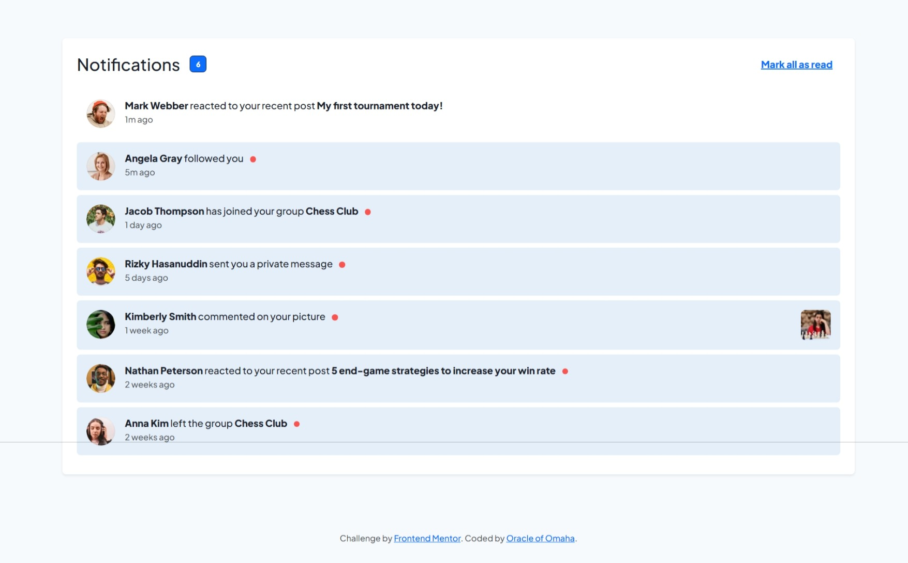

# Frontend Mentor - Notifications page solution

This is a solution to the [Notifications page challenge on Frontend Mentor](https://www.frontendmentor.io/challenges/notifications-page-DqK5QAmKbC). Frontend Mentor challenges help you improve your coding skills by building realistic projects. 

## Table of contents

- [Overview](#overview)
  - [The challenge](#the-challenge)
  - [Screenshot](#screenshot)
  - [Links](#links)
- [My process](#my-process)
  - [Built with](#built-with)
  - [What I learned](#what-i-learned)
  - [Continued development](#continued-development)
  - [Useful resources](#useful-resources)
- [Author](#author)
- [Acknowledgments](#acknowledgments)

**Note: Delete this note and update the table of contents based on what sections you keep.**

## Overview

### The challenge

Users should be able to:

- Distinguish between "unread" and "read" notifications
- Select "Mark all as read" to toggle the visual state of the unread notifications and set the number of unread messages to zero
- View the optimal layout for the interface depending on their device's screen size
- See hover and focus states for all interactive elements on the page

### Screenshot




### Links

- Solution URL: [Add solution URL here](https://github.com/Rodney-Mokenyu/notifications-page-main)
- Live Site URL: [Add live site URL here](https://Rodney-Mokenyu.github.io/notifications-page-main/)

## My process

### Built with

- Semantic HTML5 markup
- CSS custom properties
- Flexbox for layout
- Mobile-first responsive design
- Mobile-first workflow
- Vanilla JavaScript for interactivity
- Bootstrap 5 (for basic styling and utility classes)


### What I learned

- How to toggle classes and update UI dynamically with vanilla JS to reflect read/unread notification states.
- The importance of using semantic HTML elements like <button> for accessibility and keyboard navigation.
- How to use CSS custom properties to manage consistent colors and typography throughout the project.

- Handling the unread notification badge count dynamically, including updating the count after individual and bulk actions.
- Implementing accessible features such as aria-live regions for live updates and focus styles for keyboard users.

To see how you can add code snippets, see below:

```html
<h1>Some HTML code I'm proud of</h1>
```
```css
.proud-of-this-css {
  color: papayawhip;
}
```
Example code snippet for toggling read state:
```js
notificationRows.forEach((row) => {
  row.addEventListener('click', () => {
    row.classList.toggle('active'); // 'active' means read
    updateBadgeCount();
  });
});

```


### Continued development

- Improve accessibility by adding more ARIA roles and keyboard shortcuts for managing notifications.

- Explore using a framework (like React) for managing state more efficiently in a larger notifications app.

- Add animations/transitions to smooth the read/unread toggle and badge updates.

- Enhance styling for better mobile responsiveness and dark mode support.

### Useful resources

- [Frontend Mentor Notifications page challenge](https://www.frontendmentor.io/challenges/notifications-page-DqK5QAmKbC) - got the starter files from here.
- [MDN web DOCs using ARIA](https://developer.mozilla.org/en-US/docs/Web/Accessibility/ARIA) - Helpful for accessibility improvements.
- [JavaDcript.info - Event Listener](https://javascript.info/event-listeners) - Useful for understanding event handling in JavaScript.

## Author
- GitHub - https://github.com/Rodney-Mokenyu

- Frontend Mentor - [@Rodney-Mokenyu](https://www.frontendmentor.io/profile/Rodney-Mokenyu)


 
## Acknowledgments

Thanks to the Frontend Mentor community for inspiration and helpful discussions! Also, gratitude to anyone who gave feedback on my solution.